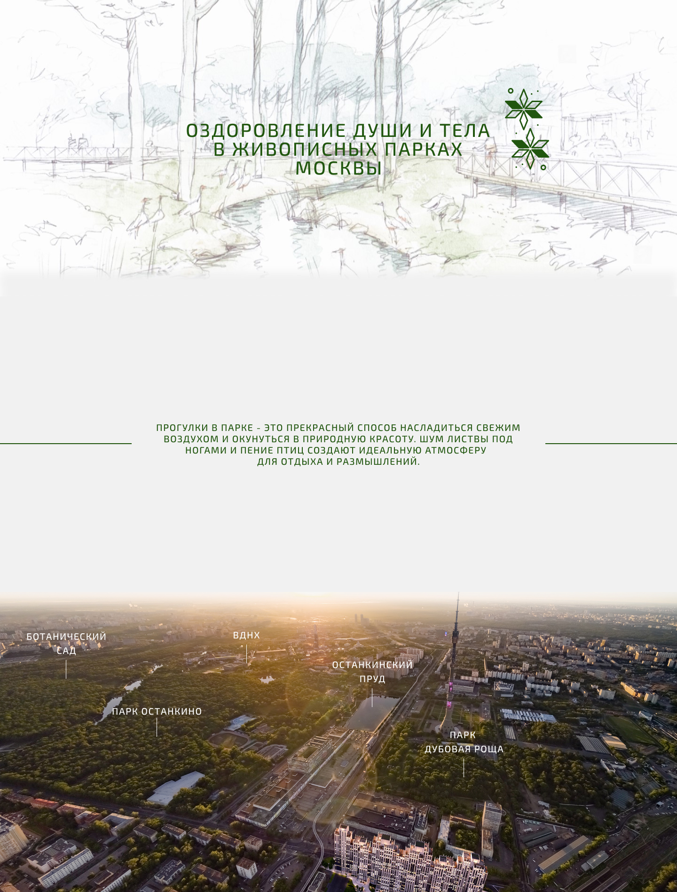

<h1 align="center">I am laying out the "Moscow Parks" layout page using the rules of flexible, adapted layout. :desktop_computer:</h1>

<h2 align="center">Parks - Desktop(1440 x 1896)</h2>

  

<h2 align="center">Parks - Tablet(768 x 1476)</h2>

  

<h2 align="center">Parks - Mobile(360 x 1197)</h2>

  

